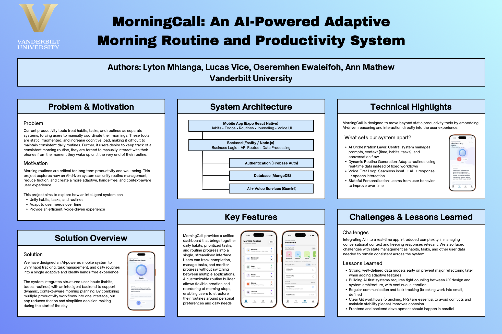
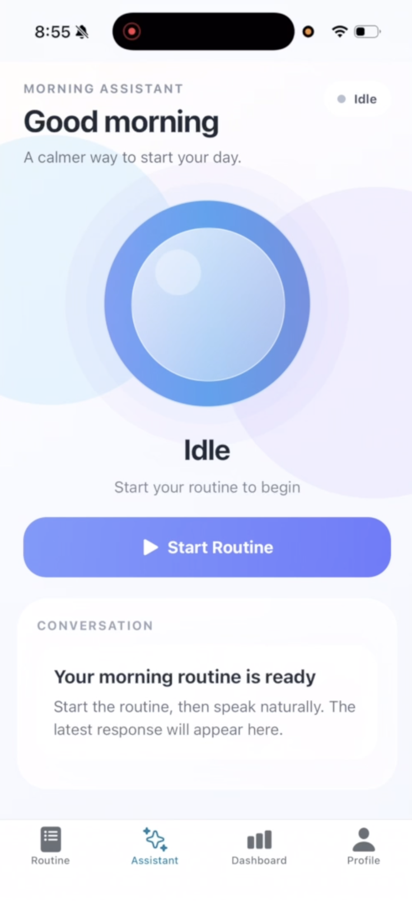
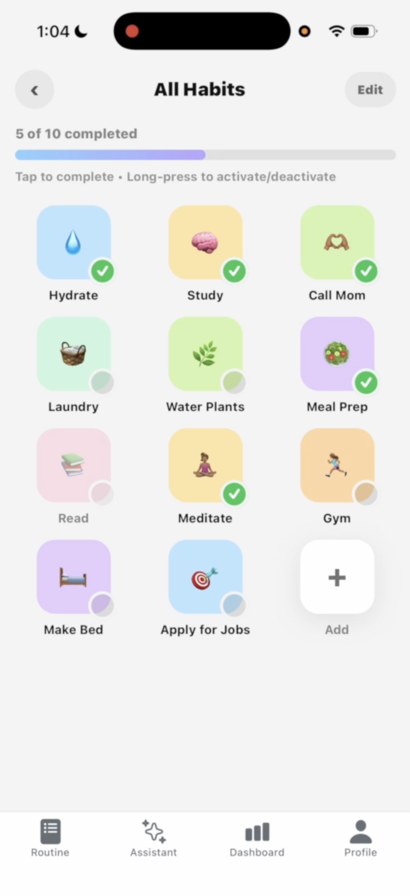
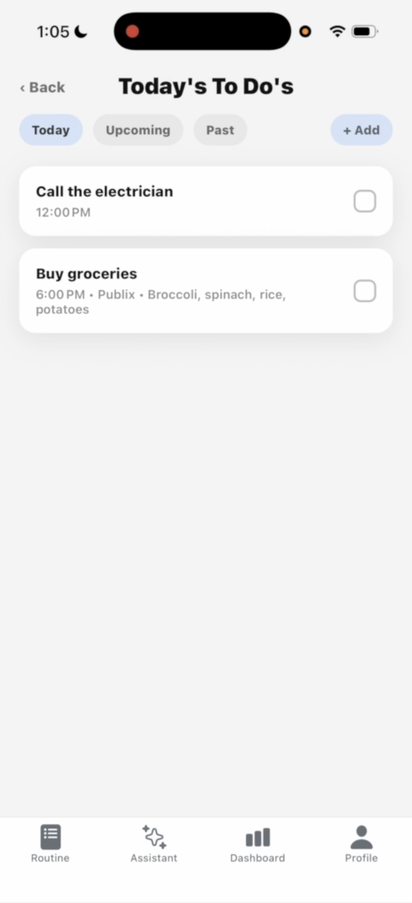
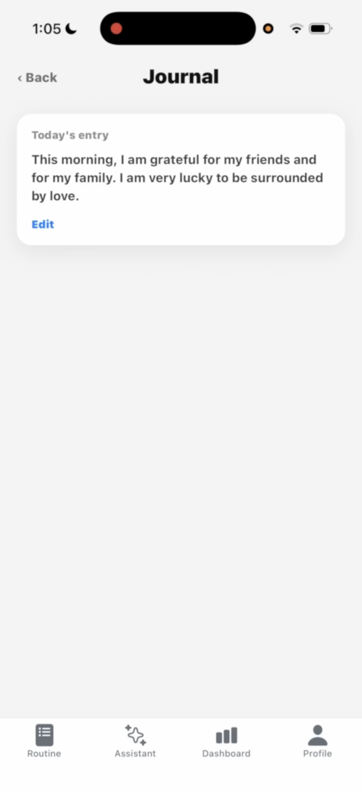
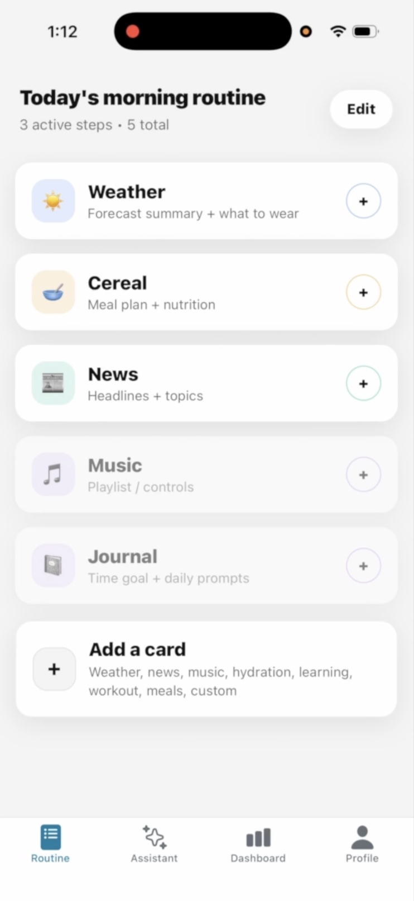
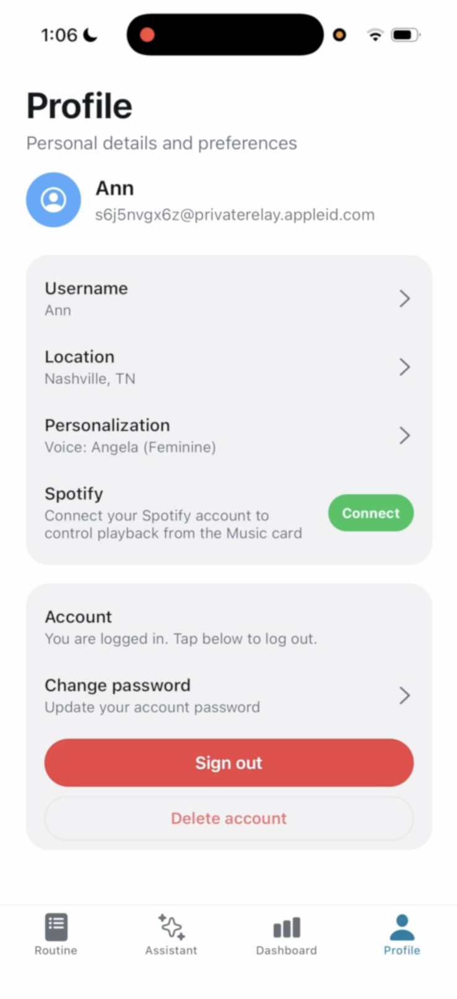

# MorningCall

An AI-powered mobile productivity application that guides users through personalized morning routines using a voice-driven AI assistant. MorningCall combines task management, habit tracking, journaling, weather, news, and third-party integrations into a single conversational experience.

**Note:** The original source code for this project is part of a private team repository and cannot be shared publicly. This repository serves as a portfolio case study and includes the project poster, demo video, screenshots, and technical documentation describing the system and my contributions.

---

# Project Overview

MorningCall is a full-stack mobile application designed to make morning routines more intentional and interactive through conversational AI.

Rather than navigating between multiple apps to check the weather, review tasks, complete habits, journal, or view fitness information, users interact with a voice assistant capable of performing authenticated actions across the application.

The project was built as a TypeScript monorepo consisting of an Expo React Native mobile application, a Fastify backend, and MongoDB for persistence. Firebase Authentication manages user identity, while OAuth integrations with Spotify and Strava securely connect external services.

One of the primary engineering goals was treating the AI assistant as another authenticated client of the backend rather than as a separate system. Instead of directly accessing application data, the language model performs actions through function calling that ultimately invoke the same REST API endpoints used by the mobile application.

---

# Demo

[](https://www.youtube.com/watch?v=GAFjmWF82tA)

*Click the image above to watch the full application demo on YouTube.*

---

# Poster

<a href="poster/poster.pdf">
  
</a>

*Click the poster to view the full-resolution PDF.*

---

# Screenshots

| AI Assistant | Habits |
|------|--------------|
|  |  |

| Todos | Journal |
|------|---------|
|  |  |

| Routine | Profile |
|---------|----------|
|  |  |

---

# Features

- Voice-driven AI assistant powered by Google Gemini
- Personalized morning routine walkthroughs
- Task management
- Habit tracking
- Daily journaling
- Current weather updates
- News summaries
- Spotify integration
- Strava integration
- Firebase Authentication (Email, Google, Apple)
- Customizable morning routine cards
- Secure OAuth token storage
- Multi-user architecture

---

# Technical Stack

| Layer | Technology |
|--------|------------|
| Mobile | React Native, Expo, Expo Router |
| Backend | Fastify, TypeScript |
| Database | MongoDB, Mongoose |
| Authentication | Firebase Authentication, Firebase Admin SDK |
| AI | Google Gemini 2.5 Flash |
| Validation | Zod |
| Monorepo | Yarn Workspaces, Turborepo |
| APIs | Spotify API, Strava API, Weather API, News API |
| Security | Helmet, Rate Limiting, Encrypted OAuth Token Storage |

---

# Architecture

MorningCall is organized as a Yarn Workspace monorepo managed with Turborepo.

```text
morningcall/
├── apps/
│   ├── mobile/        # React Native (Expo)
│   ├── backend/       # Fastify API
│   └── web/           # Placeholder workspace
├── packages/
├── turbo.json
└── package.json
```

The mobile application communicates with a Fastify REST API, which manages authentication, business logic, and persistence through MongoDB. Firebase Authentication provides identity management, allowing the backend to verify Firebase ID tokens without storing user passwords.

User-specific data—including tasks, habits, journals, and onboarding state—is stored in MongoDB collections keyed by each user's Firebase UID.

Spotify and Strava integrations use the OAuth 2.0 authorization code flow. Access and refresh tokens are encrypted before being stored, and all third-party API requests are proxied through the backend rather than exposing credentials to the mobile application.

---

# Voice Assistant Architecture

One of the most technically interesting parts of MorningCall is its conversational AI architecture.

Rather than behaving as a scripted chatbot, the assistant operates as a function-calling agent powered by Google Gemini.

The interaction flow follows a tool-use pattern:

1. The user speaks to the mobile application.
2. Speech is converted to text on-device.
3. Gemini receives the user's request along with available function definitions.
4. If the model decides a tool is required, it requests one or more function calls.
5. The application executes those functions against the backend API.
6. Results are returned to Gemini.
7. Gemini generates a natural language response.
8. The response is spoken back to the user using text-to-speech.

This architecture allows the AI assistant to create tasks, retrieve habits, complete routines, access weather information, summarize news, and perform authenticated operations without directly interacting with the database.

To improve reliability, the system prompt explicitly prevents the model from inventing database identifiers by requiring it to retrieve resources before performing update operations.

---

# Authentication

Authentication is handled through Firebase Authentication.

Supported providers include:

- Email and password
- Google Sign-In
- Apple Sign-In

The backend verifies Firebase ID tokens using the Firebase Admin SDK before authorizing protected routes. User records throughout the database are associated with Firebase UIDs instead of application-specific identifiers.

---

# State Management

The React Native application uses React Context rather than a global state management library.

Feature-specific providers manage application state for:

- Authentication
- Onboarding
- Tasks
- Habits
- Journals

Each provider communicates with the backend through REST APIs while exposing custom hooks throughout the application.

Navigation is implemented using Expo Router with route guards based on:

- Authentication state
- Onboarding progress
- Current navigation segment

---

# Security

MorningCall incorporates several backend security practices:

- Firebase ID token verification
- Helmet security headers
- Rate limiting
- Request validation with Zod
- Encrypted OAuth credential storage
- Protected API routes through Fastify pre-handlers
- Server-side proxying of third-party APIs

---

# Engineering Highlights

Throughout development, the project emphasized production-oriented engineering practices, including:

- TypeScript across the full stack
- Monorepo architecture using Turborepo
- Modular Fastify plugin architecture
- RESTful API development
- Schema validation using Zod
- Secure authentication and authorization
- OAuth 2.0 integrations
- Separation of business logic from the AI layer
- Shared backend APIs for both the mobile interface and AI assistant
- Collaborative development using Git and pull requests

---

# My Contributions

MorningCall was developed as a collaborative team project. I contributed across both the frontend and backend throughout development, helping design, implement, and refine core functionality.

My contributions included:

- Full-stack feature implementation across the React Native application and Fastify backend
- Building frontend interfaces and connecting them to backend REST APIs
- Backend API development and integration with MongoDB
- Contributing to the Firebase Authentication flow and authenticated API interactions
- Implementing application features including tasks, habits, journaling, onboarding, and routine management
- Contributing to the voice assistant experience and AI-powered workflows
- Designing and implementing portions of the user experience, including the AI assistant interface
- Making UI/UX design decisions and implementing responsive user interfaces
- Debugging, testing, and iterative refinement throughout development
- Collaborating within a shared TypeScript monorepo using Git and pull requests

---

# Future Work

Potential future improvements include:

- Calendar integrations
- Expanded AI capabilities and additional tool functions
- Push notifications and reminder scheduling
- Additional wearable and health integrations
- Analytics dashboard for long-term habit tracking
- Full web application

---

# Repository Contents

```
.
├── README.md
├── demo/
│   └── demo.mp4
├── images/
│   ├── assistant.png
│   ├── habits.png
│   ├── journal.png
│   ├── profile.png
│   ├── routine.png
│   └── todos.png
└── poster/
    └── poster.pdf
    └── poster.png
```

---

# Authors

Developed as a team project.

Portfolio repository and documentation by **Ann Mathew**.

---

Thanks for checking out MorningCall!
